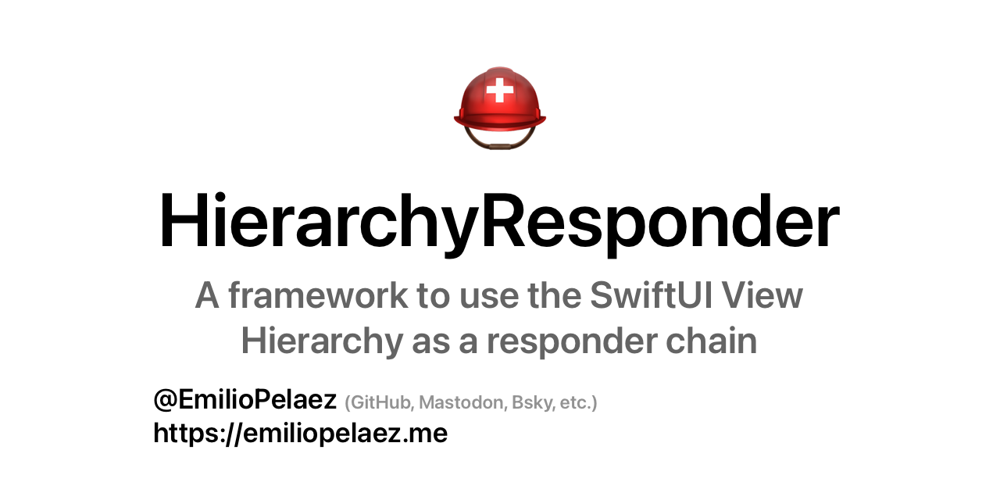

# Hierarchy Responder



<p align="center">
  
</p>

[](https://developer.apple.com/swift)
[]()

[](https://github.com/EmilioPelaez/HierarchyResponder/actions/workflows/tests.yml)
[](https://codecov.io/gh/EmilioPelaez/HierarchyResponder)

[](https://opensource.org/licenses/MIT)

`HierarchyResponder` is a framework designed to use the SwiftUI view hierarchy as a responder chain for event and error handling handling. By using the view hierarchy to report errors and trigger events, views can become more indepentent without sacrificing communication with other views.

To report an error or trigger an event, a view reads a closure from the environment, and calls that closure with the event or error as a parameter.

Views above in the view hierarchy can register different responders that will be executed with the event or error as a parameter.

<details>
  <summary>Expand for a detailed explanation.</summary>

A common pattern in SwiftUI is to pass action callbacks as closures that make their way down the view hierarchy as parameters in each view in the hierarchy. This, however, leads to views that receive these closures as parameters but make no use of them, besides passing them down.

In the simplified example below, `GridView` receives `selectionAction` as a parameter but never calls it. In a real-world application, there could be a lot more intermediate views, all of them carrying multiple parameters they only transport and don't use.

### Without HierarchyResponder

```swift
struct ParentView: View {
  @State var selection: Item?
  let items: [Item] = ...
  
  var body: some View {
    GridView(items: items, selectionAction: selectItem)
  }
  
  func selectItem(_ item: Item) {
    selection = item
  }
}

struct GridView: View {
  let items: [Item]
  let selectionAction: (Item) -> Void // <-
  
  var body: some View {
    ForEach(items) { item in
      ItemView(item: item, selectionAction: selectionAction)
    }
  }
}

struct ItemView: View {
  let item: Item
  let selectionAction: (Item) -> Void
  
  var body: some View {
    ItemPreview(_ item: Item)
      .onTapGesture {
        selectionAction(item)
      }
  }
}
```

By using the view hierarchy as a responder chain, the triggering of the event (or error) and the responding to it are isolated to the views that are active participants.

### With HierarchyResponder
```swift
struct ItemSelectionEvent: Event {
  let item: Item
}

struct ParentView: View {
  @State var selection: Item?
  let items: [Item] = ...
  
  var body: some View {
    GridView(items: items)
      .handleEvent(ItemSelectionEvent.self) {
        selection = $0.item
      }
  }
}

struct GridView: View {
  let items: [Item]
  
  var body: some View {
    ForEach(items) { item in
      ItemView(item: item)
    }
  }
}

struct ItemView: View {
  @Environment(\.triggerEvent) var triggerEvent
  let item: Item
  
  var body: some View {
    ItemPreview(_ item: Item)
      .onTapGesture {
        triggerEvent(ItemSelectionEvent(item: item))
      }
  }
}
```

For a longer explanation of this functionality, you can read [this article](https://betterprogramming.pub/building-a-responder-chain-using-the-swiftui-view-hierarchy-2a08df23689c).

</details>

## Event Protocol

`Event` is requirement-less protocol that identifies a type as an event that can be sent up the SwiftUI view hierarchy.

It can be of any type and contain any kind of additional information. It exists to avoid annotating the types used by methods in this framework as `Any`.

## Triggering an Event

Events are triggered using the `triggerEvent` object that can be read from the `Environment`. Since this object implements `callAsFunction`, it can be called like closure.

```swift
struct MyEvent: Event {}

struct TriggerView: View {
  @Environment(\.triggerEvent) var triggerEvent
  
  var body: some View {
    Button("Trigger") {
      triggerEvent(MyEvent())
    }
  }
}
```

## Reporting an Error

In a similar way to events, errors are triggered using the `reportError` closure. Since this object implements `callAsFunction`, it can be called like closure.

```swift
struct MyError: Error {}

struct TriggerView: View {
  @Environment(\.reportError) var reportError
  
  var body: some View {
    Button("Trigger") {
      reportError(MyError())
    }
  }
}
```

## What's a Responder

Responders are closures that "respond" in different ways to events or errors being triggered or reported by a view down in the view hierarchy.

There's several kinds of responders, and each responder has two versions, one that will respond to any kind of event or error, and one that receives the type of an event or error as the first parameter and will only act on values of that type.

```swift
struct ContentView: View {
  var body: some View {
    TriggerView()
      .handleEvent(MyEvent.self) {
      //  Only events of the type MyEvent will be handled
      }
      .handleEvent {
      //  All event types will be handled here
      }
  }
}
```

## Registering Responders

Registering a responder is done using the modifier syntax, and just like with any other modifier in SwiftUI, the order in which they are executed matters.

In simple terms, responders will be called in the order they added to the view, which is inverse to their position in the view hierarchy.

For a better understanding of the view hierarchy you can read [this article](https://betterprogramming.pub/building-a-responder-chain-using-the-swiftui-view-hierarchy-2a08df23689c).

```swift
struct ContentView: View {
  var body: some View {
    TriggerView()
      .handleEvent(MyEvent.self) {
      //  Will be called first
      }
      .handleEvent {
      //  Will be called second
      }
  }
}
```

### Receiving an Event or Error

When registering a receive responder, the handling closure can determine if the event or error was handled or not.

If the event or error was handled, the closure should return `.handled`, otherwise it should return `.unhandled`.

Unhandled events will continue to be propagated up the view hierarchy.

```swift
struct ContentView: View {
  var body: some View {
    TriggerView()
      .receiveEvent { event in
        if canHandle(event) {
          //  Do something
          return .handled
        }
        return .notHandled
      }
  }
}
```

### Handling an Event or Error

Handle responders will consume the event or error they receive, which will stop it from propagating up the view hierarchy. This is equivalent to using a `receiveEvent` closure that always returns `.handled`.


### Transforming an Event or Error

Transforming functions can be used to replace the received value with another.

### Catching Errors

Catching responders allow you to receive an error and convert it into an event that will be propagated instead.

```swift
struct UnauthenticatedError: Error {}
struct ShowSignInEvent: Event {}

struct ContentView: View {
  var body: some View {
    TriggerView()
      .catchError(UnauthenticatedError.self) {
        ShowSignInEvent()
      }
  }
}
```

### Failable Responders

All event responders, as well as the catchError responders, receive a throwing closure. Any errors thrown inside this closure will be propagated up the view hierarchy as if it had been reported using the `reportError` closure.

```swift
struct ContentView: View {
  var body: some View {
    TriggerView()
      .handleEvent { event in
        guard canHandle(event) else {
          throw AnError()
        }
        //  Handle Event
      }
  }
}
```

## Events originating outside the View Hierarchy
The `triggerEvent` can be used to handle events that are originated within the view hierarchy, but some events, like menu bar actions, intents, deep linking, navigation events, shake events, etc. can originate from outside of the view hierarchy, and it can be tricky to make sure they're delivered to the right view.

The `.publisher` view modifier generates an `EventPublisher` object that can be used to publish an event that will traverse the view hierarchy "downwards", allowing us to, by default, find the last subscriber to the event.

For example, imagine you have multiple views listening to shake events via NotificationCenter, but as the user navigates through the app, some of these views may not be on screen but still be present in the view hierarchy. You could listen to the NotificationCenter event at the root of your app and publish an event that will only be delivered to the last subscriber, which would be the view that is currently on screen.

## Other Goodies

### EventButton

`EventButton` is essentially a wrapper for `Button` that receives, instead of an action closure, an `Event` that is triggered whenever the underlying Button's action would be called.

### onTapGesture(trigger:)

The `onTapGesture(trigger:)` modifier works just like `onTapGesture(perform:)`, but instead of executing a closure it triggers an event.

### AlertableErrors

`AlertableError` is a protocol that conforms to Error and represents a user-friendly error with a message and an optional title.

By using the `.handleAlertErrors()` modifier, errors that conform to the `AlertableError` protocol will be handled by displaying an alert with the title and message provided by the error.
