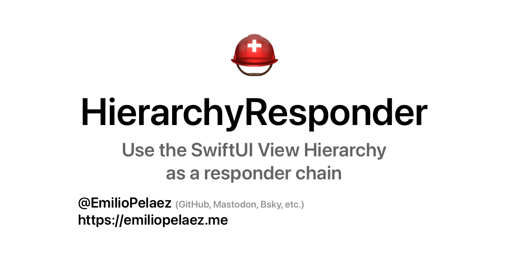

# Hierarchy Responder



[](https://developer.apple.com/swift)
[]()

[](https://github.com/EmilioPelaez/HierarchyResponder/actions/workflows/tests.yml)
[](https://codecov.io/gh/EmilioPelaez/HierarchyResponder)

[](https://opensource.org/licenses/MIT)

`HierarchyResponder` is a framework designed to use the SwiftUI view hierarchy as a responder chain for event and error handling. By using the view hierarchy to report errors and trigger events, views can become more indepentent without sacrificing communication with other views.

To report an error or trigger an event, a view reads a closure from the environment, and calls that closure with the event or error as a parameter.

Views above in the view hierarchy can register different responders that will be executed with the event or error as a parameter.

```swift
struct ItemSelectionEvent: Event {
  let item: Item
}

struct ParentView: View {
  @State var selection: Item?
  let items: [Item] = ...
  
  var body: some View {
    GridView(items: items)
      // The handleEvent modifier registers a responder closure to be executed when
      // an ItemSelectionEvent is triggered in any descendant view
      .handleEvent(ItemSelectionEvent.self) { event in
        selection = event.item
      }
      .sheet(item: selection) { ItemDetail($0) }
  }
}

struct GridView: View {
  let items: [Item]
  
  var body: some View {
    ForEach(items) { item in
      ItemView(item: item)
    }
  }
}

struct ItemView: View {
  @Environment(\.triggerEvent) var triggerEvent
  let item: Item
  
  var body: some View {
    ItemPreview(item)
      .onTapGesture {
        // The triggerEvent object, called as a closure, triggers an event which
        // will be received by any ancestor views that registered a responder
        triggerEvent(ItemSelectionEvent(item: item))
      }
  }
}
```

## Overview

HierarchyResponder provides an alternative to common methods of handling interaction on child views in SwiftUI. Instead of prop drilling with action closures, or injecting state objects into the environment that create heavy dependencies for child views, or creating external dependency containers that act as complex singletons, views that contain logic can register "responder" closures that will be called when a descendant view triggers an event or reports an error.

Any views that happen to be between the interactive view and the view that receives the event have no part in this communication between views. The interactive view can adopt a fire-and-forget model that allows it to be free of logic, lighter, and easier to preview. The view hierarchy can be easily altered without adjusting parameters like it would be necessary when doing prop drilling.

Just like when using an `EnvironmentObject`, the compiler can't tell if a responder has been registered for a given event, but an important difference is that failing to respond to an event will only cause a crash when building for `DEBUG`, and when the view is **not** in being previewed. This frees views of having a strong dependency on environment objects.

### The Event Protocol

`Event` is a requirement-less protocol that identifies a type as an event that can be sent up the SwiftUI view hierarchy.

It can be of any type and contain any kind of additional information. It exists to be able to easily identify a type as an object, and to avoid having to annotate the types used by methods in this framework as `Any`.

### Triggering an Event

Events are triggered using the `triggerEvent` object that can be read from the `Environment`. Since this object implements `callAsFunction`, it can be called like closure.

```swift
struct MyEvent: Event {}

struct TriggerView: View {
  @Environment(\.triggerEvent) var triggerEvent
  
  var body: some View {
    Button("Trigger") {
      triggerEvent(MyEvent())
    }
  }
}
```

### Reporting an Error

In a similar way to events, errors are triggered using the `reportError` closure. Since this object implements `callAsFunction`, it can be called like closure.

```swift
struct MyError: Error {}

struct TriggerView: View {
  @Environment(\.reportError) var reportError
  
  var body: some View {
    Button("Trigger") {
      reportError(MyError())
    }
  }
}
```

### What's a Responder

Responders are closures that "respond" in different ways to events or errors being triggered or reported by a view down in the view hierarchy.

There's several kinds of responders, and each responder has two versions, one that will respond to any kind of event or error, and one that receives the type of an event or error as the first parameter and will only act on values of that type.

```swift
struct ContentView: View {
  var body: some View {
    TriggerView()
      .handleEvent(MyEvent.self) {
      //  Only events of the type MyEvent will be handled
      }
      .handleEvent {
      //  All event types will be handled here
      }
  }
}
```

### Registering Responders

Registering a responder is done using the modifier syntax, and just like with any other modifier in SwiftUI, the order in which they are executed **matters**.

In simple terms, responders will be called in the order they added to the view, which is inverse to their position in the view hierarchy.

For a better understanding of the view hierarchy you can read [this article](https://betterprogramming.pub/building-a-responder-chain-using-the-swiftui-view-hierarchy-2a08df23689c).

```swift
struct ContentView: View {
  var body: some View {
    TriggerView()
      .handleEvent(MyEvent.self) {
      //  Will be called first and absorb `MyEvent` objects
      }
      .handleEvent {
      //  Will be called second, will not receive any `MyEvent` objects
      }
  }
}
```

#### Receiving an Event or Error

When registering a receive responder, the handling closure will determine if the event or error was handled or not.

If the event or error was handled, the closure should return `.handled`, otherwise it should return `.unhandled`.

Unhandled events will continue to be propagated up the view hierarchy.

```swift
struct ContentView: View {
  var body: some View {
    TriggerView()
      .receiveEvent { event in
        if canHandle(event) {
          //  Do something
          return .handled
        }
        return .notHandled
      }
  }
}
```

#### Handling an Event or Error

Handle responders will consume the event or error they receive, which will stop it from propagating up the view hierarchy. This is equivalent to using a `receiveEvent` closure that always returns `.handled`.


#### Transforming an Event or Error

Transforming functions can be used to replace the received value with another.

```swift
struct ContentView: View {
  var body: some View {
    TriggerView()
      .transformEvent(MyEvent.self) {
        return AnotherEvent()
      }
  }
}
```

#### Failable Responders

All event responders, as well as the `catchError` responders, receive a throwing closure. Any errors thrown inside this closure will be propagated up the view hierarchy as if it had been reported using the `reportError` closure.

```swift
struct ContentView: View {
  var body: some View {
    TriggerView()
      .handleEvent { event in
        guard canHandle(event) else {
          throw AnError()
        }
        //  Handle Event
      }
  }
}
```

#### Catching Errors

Catching responders allow you to receive an error and convert it into an event that will be propagated instead.

```swift
struct UnauthenticatedError: Error {}
struct ShowSignInEvent: Event {}

struct ContentView: View {
  var body: some View {
    TriggerView()
      .catchError(UnauthenticatedError.self) {
        ShowSignInEvent()
      }
  }
}
```

### Safety

A trade-off of the flexibility offered by this pattern is that it can be easy to lose track of where events are generated and handled. A few modifiers are included to mitigate this.

The `.triggers` and `.reports` modifiers can be used by views that contain complex hierarchies (like a screen view) to expose a kind of "API" to any views that utilize it.

```swift
struct FeedView: View {
  var body: some View {
    FeedList()
      .triggers(ShowPostEvent.self, ShowProfileEvent.self)
      .reports(AuthenticationError.self)
  }
}
```

These modifiers are not only useful for the developer consuming the `FeedView` object, they also act as a runtime check that will raise a warning if an event or error that is not on the list is utilized, and when explicit responders are required (enabled by default) it will raise a warning if there are no responders for these specific events and errors above in the hierarchy.

The `.responderSafetyLevel` and `.requireExplicitResponders` modifiers allow customization of the behavior of the safety checks. The default responder safety level will throw console warnings, the strict safety level will trigger a `fatalError`, and the disabled safety level will ignore any infractions. All of these checks are disabled on release builds, to avoid causing crashes for users.

### Events originating outside the View Hierarchy
The `triggerEvent` can be used to handle events that are originated within the view hierarchy, but some events, like menu bar actions, intents, deep linking, navigation events, shake events, etc. can originate from outside of the view hierarchy, and it can be tricky to make sure they're delivered to the right view.

The `.publisher` view modifier generates an `EventPublisher` object that can be used to publish an event that will traverse the view hierarchy "downwards", allowing us to, by default, find the last subscriber to the event.

For example, imagine you have multiple views listening to shake events via NotificationCenter, but as the user navigates through the app, some of these views may not be on screen but still be present in the view hierarchy. You could listen to the NotificationCenter event at the root of your app and publish an event that will only be delivered to the last subscriber, which would be the view that is currently on screen.

### Other Goodies

#### EventButton

`EventButton` is essentially a wrapper for `Button` that receives, instead of an action closure, an `Event` that is triggered whenever the underlying Button's action would be called.

#### onTapGesture(trigger:)

The `onTapGesture(trigger:)` modifier works just like `onTapGesture(perform:)`, but instead of executing a closure it triggers an event.

#### AlertableErrors

`AlertableError` is a protocol that conforms to Error and represents a user-friendly error with a message and an optional title.

By using the `.handleAlertErrors()` modifier, errors that conform to the `AlertableError` protocol will be handled by displaying an alert with the title and message provided by the error.
